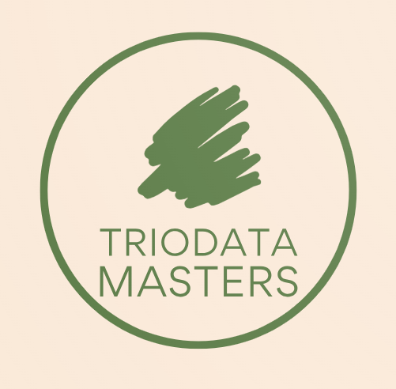
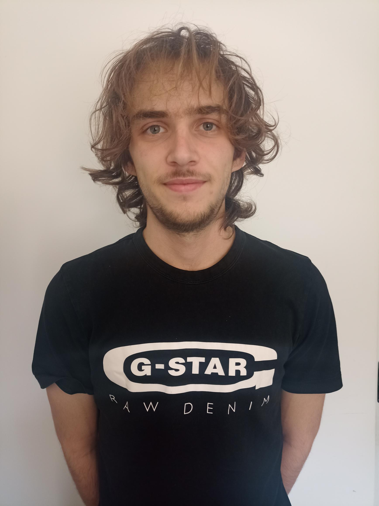

# TrioData_Masters

At Triodata Masters, we are the architects of data excellence. With a combined passion for data management and a commitment to unlocking its full potential, our founders Emalisa, Hannah, and Liesa have come together to build a company that stands as a beacon of innovation and precision in the world of data.

Triodata Masters is not just a data management company; we are your trusted partners in harnessing the power of your data to drive informed decisions, achieve operational efficiency, and propel your organization into the future. Our mission is to empower businesses of all sizes and industries with top-tier data management solutions that fuel growth, innovation, and success.

We understand that in today's data-driven world, the quality, security, and accessibility of your data are paramount. That's why we combine our expertise with cutting-edge technology to ensure your data is not only managed but mastered. Whether you're looking to optimize your data infrastructure, implement advanced analytics, or enhance data security, Triodata Masters has the knowledge, experience, and dedication to turn your data challenges into opportunities.

Join us on this journey of data mastery and let us help you transform your business. Welcome to Triodata Masters, where data meets its true potential.

> *"At Triodata Masters, we are committed to mastering the art and science of data. Our unwavering dedication to excellence drives us to deliver innovative, tailored data management solutions that empower our clients to thrive in an increasingly data-centric world. We believe that every data point holds the potential to transform businesses, and we are here to unlock that potential for you. With Triodata Masters, your data is not just managed; it's mastered."*

# Meet the team!
### Emalisa - *The Coach*

As the Data Management Team Coach at TrioData Masters, I play a crucial role in guiding and empowering our talented team of data management professionals. My passion for data excellence and commitment to our clients' success drive me to lead by example and ensure that every member of our team reaches their full potential.         

### Liesa - *The Librarian*

As the librarian at company name I make sure all the documents are filled in correctly and uploaded on time. I make sure that all the important details are written down and taken into account. During our meetings with our clients I miss no details and make sure everything is according to our clients wish.      

### Hannah - *The Psychologist*

As a Psychologist in our IT firm, my role is pivotal in fostering a psychologically healthy and harmonious work environment. I leverage my expertise in psychology to support our employees, teams, and clients in developing positive relationships, effective communication, and mental well-being. Through counseling, conflict resolution, training, and research, I contribute to the overall success of our organization by enhancing interpersonal dynamics and promoting a culture of collaboration, innovation, and employee satisfaction.    

### Jeffrey - *The Computer Systems Administrator*

In my role as  Computer Systems Administrator at TrioData Masters, I ensure the smooth operation of our IT systems. I manage servers, networks, and data security. This includes backups, updates, and user support. I also plan for future growth, ensure compliance, and maintain documentation. My role is crucial in upholding data integrity and security in our data-focused environment.