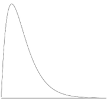
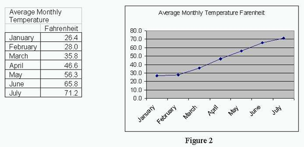

# Discussion topics part 1

## General statistics:
1. The chances of somebody dying on their birthday are 13% higher than on any other day. Is this possible? Explain.
Yes, people do special things on their birthday, often more dangerous things. Birthdays also often lead to intoxication. There appears to be a things called the []'Birthday Effect'](https://en.wikipedia.org/wiki/Birthday_effect ) that has some research conducted on it. It is suggested that alcohol consumption, psychological, physiological and statistical effects.
1. What does the following graph say about the test of which it represents the scores?

    

This graph is right skewed. This implies that there were a lot of low scores and some high grades. This is probably due to the test having been very difficult or the teacher not having done a good job at explaining the subject matter.

1. The following graph tries to make the point that global warming is out of control. But what is wrong with it?

    

This graph shows the monthly averages for one year. This can easily be explained through the changing of the seasons and thus does not say anything about overall global change.

1. Under which conditions can a pie chart be used?
A pie chart can be used when discussing a composition with a maximum of five categories.

1. Explain the difference between “variation” and “covariation” with an example of our hypothetical student-grade-dataset.
Variation measures the spread of a single variable, while covariation measures the relationship between two variables. Applying this to our hypothetical dataset we could apply the variation to gain insights into the spread of the grades. If we want to compare the grades to the hours learned we could apply the covariance to gain insight into the correlation between the two.

1. What is the difference between a bar plot and a histogram? When do we use them?
A histogram is used to look at the spread of your quantitative data. It is good at handling continuous data. Bar plots are used to visualize categorical data and are not suited for continuous data. An important difference is also that in histograms you look at the values within one category while a bar chart compares different categories. Visually bar charts and histograms can be distinguished because histograms do not have white space between the bars while bar charts generally do.

1. How can you explore covariation? Are there different graphs that we can use?
Scatter plots, heat maps, pair plots, correlation matrices, and partial regression plots are useful to explore covariation. Important insights can also be gained from applying formulas. 

1. Explain covariance and correlation with an example.
Covariance will tell you if there is a relationship between to variables, if the covariance is zero, you know that there is no relation. If the covariance is not zero, you know that there is a relation, but not how strong this relation is. The strength of this covariance is expressed as correlation, which is always a value between -1 and 1. If there is a positive covariance between grades and hours learned you know that these two variables increase together. If the correlation is a higher number such as 0.8 you know that this is a strong relation.

## Ethics in AI

1. Suppose we record all information on our students (gender, race, height, shoe size, schooling history, profession of parents, …) and use this to only allow students with a reasonable chance of succeeding to start in the first year. Would that be a good idea? Would it be an ethical idea?
(Good: something that works, that does what it is supposed to, Ethical: Being in accordance with the accepted principles of right and wrong that govern the conduct of a profession. E.g., robbing a bank is a good idea because it gets you a lot of money fast, but it isn’t an ethical idea because it is illegal and people may die.)
We do not think this would be a good idea. Primarily because, even if there is a relation between these variables and academic success, it is difficult to say when a relation is strong enough. Also correlation does not mean causation. In this case causation seems unlikely to there is a big chance that you are excluding valuable students. We also do not believe this is ethical as in this case you are punishing people for things over which they do not have any influence.

1. Suppose we record all school-related information on our students (class attendance, exam results, how long they studied, …) and compare this with the results of students finishing the first year, it would give us an insight in their chances of finishing our program in a timely fashion.
What if we forbid students that we think would not finish or take more than 4 years to continue in our program. Would that be a good/ethical idea?
What if we wouldn’t forbid them, but simply gave them a very strong warning (unless you dramatically change some of these parameters, you won’t be finishing this program according to the data). Would that be a good/ethical idea?
We believe a warning to be good and ethical thing: you let people know that they are unlikely to finish the programme in a timely fashion and allow them to make their own decisions with this information. We believe forbidding is more complex: we do not think it is ethical. We believe people should be allowed to make their own decisions. But it may be good. We believe immediately forbidding a student is not good: we think it would be a better idea to inform them on their poor trajectory and offer them help (i.e. a calmer programmer or study guidance). If they do not improve after this it would probably be a good thing to forbid them from continuing. 

## Group forming

1. Let everyone in your group take a random personality test (Enneagram, Typefinder or MBTI, Big Five Assessment, Career Profiler, Workplace DISC Test, …). Compare these totally unrelated results.
1. Generate a couple of random roles using https://www.randomlists.com/random-jobs (you can rerun as much as necessary). Assign all team members a role with description of tasks.
1. The three of you start a company that specializes in data management. Think of a name. Write (or let some AI generate) a company introduction and mission statement.
1. Use another AI-model to generate a company image, preferably something that is reflected in your company name.
1. Create a markdown file with your company information, a professional picture of every one of you along with your job title and tasks. Upload this in your github as “README.md” and post the link to the repo in the team chat you made that included the instructor.
