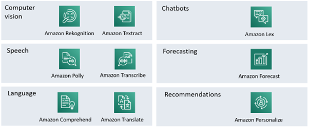

# Discussion topics part 2

## The AWS-lesson

1. Is it a good idea to be using Python and Jupyter notebooks? Are there any alternatives like Julia, R, Java, C#, …?
There definitely are alternatives, but as Python is very clear, easy to work with, and cross-platform we think it is a good idea to be using Python and Jupyter Notebooks. Any of the alternatives would be a lot more laborious.

2. Amazon has some managed services that provide AI-services without the need for any real understanding of the technology involved. Will they preform better than a model that we can make ourselves? What are the [dis]advantages of using them?

    

A big disadvantage to the Amazon services is the high cost, it is also more difficult to trouble shoot as you don't know the underlying technology. An advantage to these services is that it is both quick and easy to use. The amazon services are probably also more scalable than your own technology would be. 

3. Give an example of supervised and unsupervised learning when using a file with all data about students (grades, but also age, shoe size, family situation, …).
Supervised learning would be applying regression techniques such as linear regression or decision tree regression to build a predictive model. With this model we learn about the relationship between the features and the final exam grades. The unsupervised learning would be using a algorithm like K-Means or hierarchical clustering to group attributes. The algorithm will reveal clusters of students with the same features.

4. We have a file of student grades and how much they studied for a test. We want to predict their test scores. Explain the difference between binary classification, multi-label classification and regression in this context.
So for Binary Classification you typically have two classes/outcomes. This means that the test scores will be pass or fail. The Multi-label Classification has more classes for example "Excellent", "Good", "Average" and "Poor". When regression is used, you predict a continuous numeric value. In this case it will be the exact test scores that are achieved based on the study time.

5. Can we use AI to do feature engineering? Is it regularly done this way?
Feature engineering can definitely be done by AI, it is often done that way, but we think that it would be better done by people with knowledge of the field as AI is not well fitted to interpret the data. However, using AI would save a lot of time and effort.

6. Explain over- and underfitting in the context of multi-label classification.
Overfitting in multi-label classification may include high accuracy on the training data but poor performance on new, unseen examples (low precision, low recall, or low F1-score for certain labels). Underfitting may include low accuracy on both the training data and validation/test data. The model simply fails to learn the complexities of the problem.

## The powerpoint and exercises

1. The powerpoint states: "The model should generalize to unseen data if you are using it to predict. If it’s just to explain the data overfitting isn’t a problem." Explain!
If you want to predict based on existing data it is important not to overfit but keep your models simple as it is near to impossible to have accurate predictions on too complex models. However, these complex models do take more of the actual data into account (i.e. noise, outliers) which gives a more accurate representation of the data you have.

1. To get rid of outliers, we simply look at the values and delete the row with the highest value for every column. Or is there a better way?
Instead of getting rid of outliers you could replace them with the mean value. Instead of just removing/replacing the highest and lowest you could delete everything from the 1st and 99th percentile. You could also use the root-mean-square deviation to decide which data points count as outliers. The data could also be transformed to make it less sensitive to outliers. There are a lot of different ways to deal with outliers, which one is the best ultimately depends on your dataset.

1. Why does the Z-score doesn't matter in a column that is used in one hot encoding?
In one hot encoding the values are binary, not continuous. For this reason standard deviations do not apply to one hot encoding and thus neither does the Z-score.

1. What is scaling/normalization of data?
Scaling or normalization of data is a preprocessing step that involves transforming the features (variables) of your dataset to a standard scale or range. The goal of to ensure that all features have similar scales or magnitudes, which can help improve the performance of certain algorithms and make your data more suitable for modeling.
